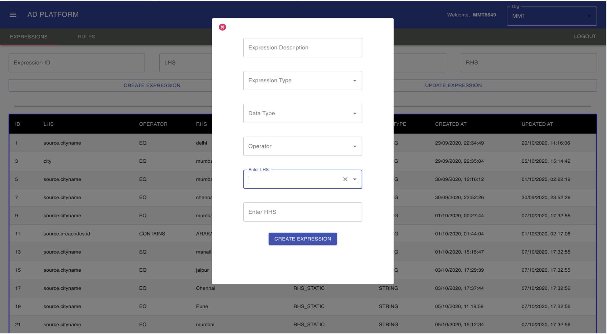
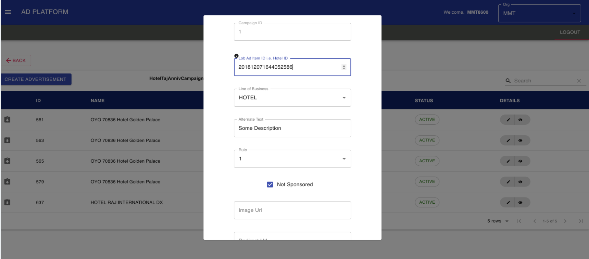
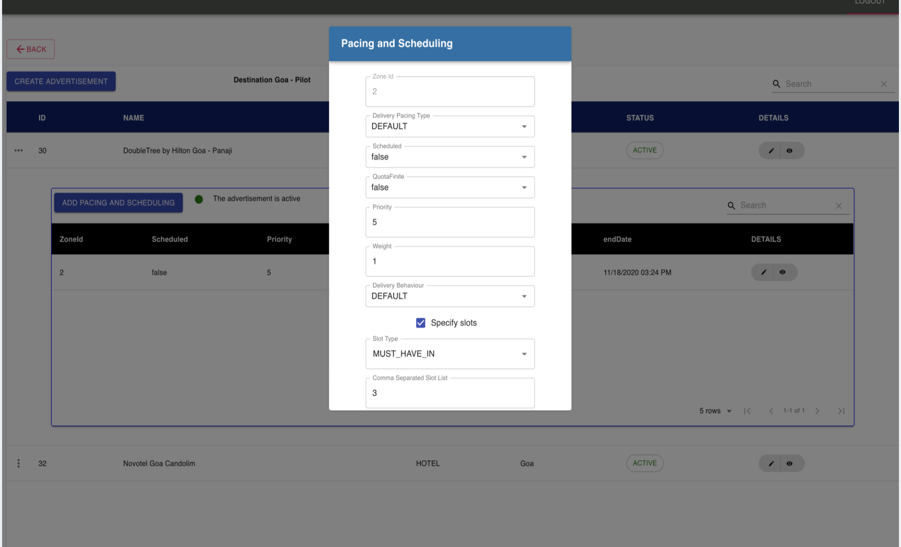

# AdOrch-Admin

## Expressions
An Expression is a representation of a particular specification of a given entity. eg. City Equals to Jaipur entails an Expression. A Given Expression primarily comprises of a LHS Operator and RHS, in the same order. Other relevant properties of an expression are the type, the data type involved in the expression and a relevant description of what the expression is.

Above is an image of the Create Expression page. The fields description are as follows:-

- **Expression type** : The possible values in this field are LHS_STATIC or RHS_STATIC. In most cases the choice should be RHS_STATIC, unless otherwise specified.
- **Data type** : This field denotes the data type of the RHS (Right Hand Side of the Expression). For eg. if we are creating an expression of is City equal to Jaipur, the datatype is String. Likewise it can be integer, or boolean (true or false), or other as visible in the dropdown prompt.
- **Operator** : Once we select a datatype, the possible operators for the given datatype will be shown on screen. The operator values are EQ (Equal to), LTE (Lesser than or equal to), and so on. Operator short forms are intuitive and can be chosen based on usecase
- **LHS** : Short form for Left Hand side, the LHS denotes the field for which the given expression is to be made. For example, if we want to know the if the City is Jaipur, Then the CityName will be the LHS value.
- **RHS** : Short form for Right Hand side, the RHS denotes what would would be the value/threshold set of values that the given expression can take. eg. Jaipur is an RHS Value, 5 star rating of a hotel is RHS value The value is entirely dependent on the reason as to why the expression is being made

**Note** : Update Expression follows a similar format, except that in Update we need to specify the Expression ID that is to be updated. The ID can be obtained from the Expression Table

## Rules

A Rule is a set of expressions, with operators such as AND, OR between the given expressions . eg. 'City Equals to Jaipur OR City Equals to Panaji' entails a Rule. In the portal, a Rule is created by a set of expression ID's ( visible in a list), in conjunction with operators between the expression ID's. There are two ways to create a Rule. The first way, is by using the drag and drop feature, or by simply typing the rule to be created.

Above is an image of the Create Expression page. The fields description are as follows:-

- **Drag and drop** : Drag the expression you want to include in your rule from the list, and drop it into the blank box. The operators are available to the right, and are draggable in the same fashion Please ensure that while creating a rule, the braces are balanced, the expression ID's are valid. Click on save rule to create
- **Type Instead** :  Type the operator separated list of expressions in the typebox. Have a look at Rule Description in table to understand how to type the expressions. Please do not type spaces in between while creating a rule. Doing so may result in the rule not being created.

**Note** : Update Rule follows a similar format, except that in Update we need to specify the Rule ID that is to be updated. The ID can be obtained from the Rule Table . To Update the given Rule, choose the Update option from the Create, Update Dropdown option.

## Advertisements

**Overview**
- The Advertisement section lists down all the Advertisements of a given Camapiagn and Advertiser. Each Advertiser can have multiple campaigns and each campaign can have muilitple Advertisements. The table shows various field such as Id, Name, Lob (line of business), etc.The field Details shows additional info about the Advertisement. When clicked, it opens up Box containing the information of the Advertisement. It can also be used to edit or update Advertisement. For eg if the RULE of the Advertisement needs to be changed from say 1 to 2, same can be done buy selecting the corresping rule form the Rule textbox and pressing Update Advertisement.
- The **Search Field** at the top right corner of the table can be used to search amongst all advertisements. The field Status is a Button which can be used to toggle the status of the Advertisement (Eg from ACTIVE to PAUSED).
***NOTE**: If you update only one field, rest of the fields will remain same as earlier.

- There is also an option to create a new Advertisement. It can be done by pressing the the Create Advertisement button and filling in the required fields.
- The Down arrow Button at the left side of each row shows pacing and Scheduling when clicked.

## Pacing And Scheduling

**Overview**
- This Section lists down the Pacing and Scheduling Info of an Advertisement zone wise (every zone to which this Ad is mapped to). It also provides for an option to **Add a Fresh Pacing and Scheduling data for a new zone**.The table shows various field such as ZoneId, Scheduled, Status, etc. The field **Details** shows additional info about. When clicked, it opens up Box containing the additional information. It can also be used to edit or update Pacing ans Scheduling Data for the respective Advertisement.

***NOTE**: If you update only one field, rest of the fields will remain same as earlier.

- The **Search Field** at the top right corner of the table can be used to search amongst all mappings across different Zones. (***currently only with Zone wiht ZoneId 2 is Active**). The field **Status** is a Button which can be used to toggle the status of the Advertisement (Eg from ACTIVE to PAUSED). Note the Difference between the status value of the Advertisement and the status value of the Pacing and Scheduling. The Advertisement Status can have only two values (ACTIVE/PAUSED) whereas as Pacing and Scheduling status can have multiple values (ACTIVE("ACTIVE"),EXPIRED("EXPIRED"),PAUSED("PAUSED"),QUOTA_REACHED("QUOTA_REACHED"),QUEUED("QUEUED")). If the Status is ACTIVE/PAUSED, only then it is possible to toggle the status, otherwise not.

